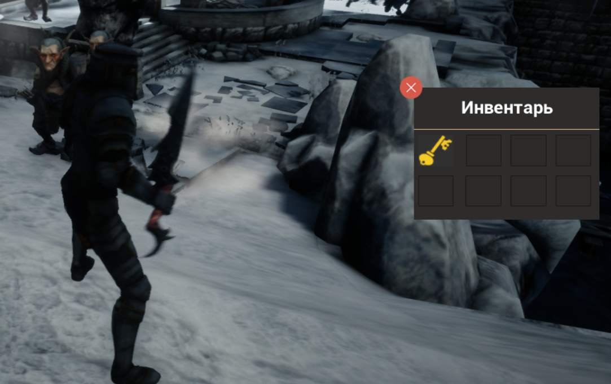
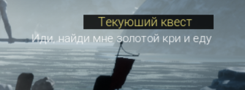
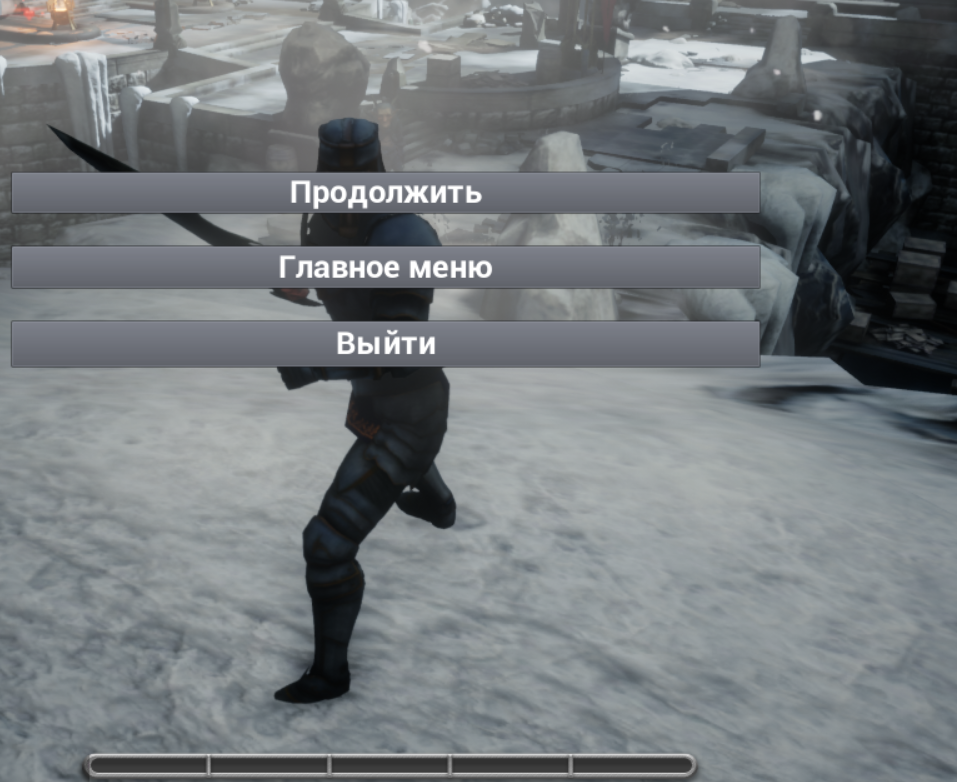

- [rutube.ru (VIDEO)](https://rutube.ru/video/private/ee481339d0ff0b420245ea8d588e2b9c/?r=wd&p=5gwAsSyNzHqGeSsAu5y_ig)
- [plvideo.ru (VIDEO)](https://plvideo.ru/watch?v=XO2u7eo4Vqpl)

Expand game images

## Unreal Engine 4

RPG Game **ForestHunter**

- Added classes: Mage/Warrior
- Added HP/MP bars
- Implemented a leveling system and EXP with a running line
- Added attack skills
- Created an initial inventory
- Added two items: key and wood
- Introduced AI monsters, specifically goblins with no damage capability
- Implemented animation for item drops from monsters
- Added an animation for using skills and cooldowns in the active control panel
- Created a menu: Continue, Main Menu, Exit
- Implemented a jumping system
- Added damage chat for NPC interactions

## Minimum System Requirements

- **Operating System:** Windows 7 or higher
- **Processor:** 2.0 GHz or higher
- **RAM:** 4 GB or higher
- **Graphics Card:** Support for DirectX 9, 10, or 11  
  Recommended: DirectX 11 support for optimal performance
- **Hard Drive Space:** 10 GB of free space

Ensure that your system has the appropriate version of DirectX installed to run the application smoothly.

---

### Features
- We present to you our new game, developed using the visual scripting system Blueprints in Unreal Engine.
- Thanks to this approach, we were able to quickly implement all our ideas and mechanics.

### Important
Please note that the source code of the game cannot be provided, as the project was entirely created using Blueprints. Therefore, we cannot grant access to the source files in C++.

### Suggestions
We would be happy to receive your feedback and suggestions for improving the game! Thank you for your support!
